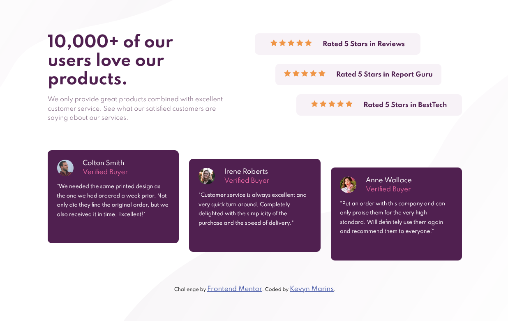

# Frontend Mentor - Social proof section solution

This is a solution to the [Social proof section challenge on Frontend Mentor](https://www.frontendmentor.io/challenges/social-proof-section-6e0qTv_bA).

## Table of contents

- [Overview](#overview)
  - [The challenge](#the-challenge)
  - [Screenshot](#screenshot)
  - [Links](#links)
- [My process](#my-process)
  - [Built with](#built-with)
  - [What I learned](#what-i-learned)
  - [Continued development](#continued-development)  
- [Author](#author)

## Overview

### The challenge

Users should be able to:

- View the optimal layout for the section depending on their device's screen size

### Screenshot

### Links

- Live Site URL: [Social proof section](https://kevynsm.github.io/Social-proof-section/)

## My process

### Built with

- Semantic HTML5 markup
- CSS custom properties
- Flexbox
- CSS Grid
- Mobile-first workflow

### What I learned

I used this project to practice my HTML and CSS skills, focusing mainly on Grid, Flexbox and Media Queries.

### Continued development

It was my first project using Grid and I still have a lot to learn, so for the next project I will continue to practice using Grid together with FlexBox and Media Queries which I am now getting more comfortable with.

## Author

- Frontend Mentor - [@KevynSM](https://www.frontendmentor.io/profile/KevynSM)
